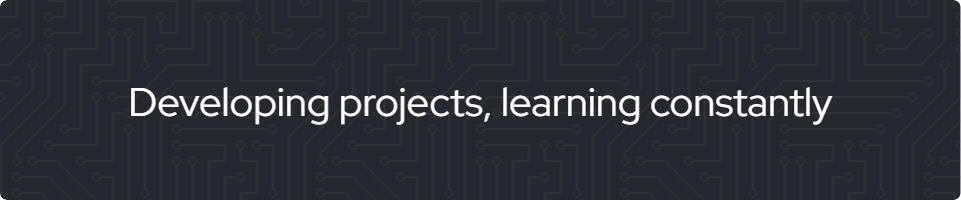

    <h1>Hi, I'm Alejandro 👋</h1>

## About me 👨🏻‍💻

I am a developer passionate about learning programming and creating independent projects in my free time, with the aim of improving my skills and connecting with the developer community.

Currently, I use Python as my main programming language, complemented with other technologies that I am in the process of mastering. My goal is to apply these skills in future projects, which I invite you to review and support if they are of interest to you.

## Familiar technologies 👾

## Technologies to learn 📖

## Featured projects 📌

Still, I don't have any projects ready. I'll start uploading them to the platform soon.

